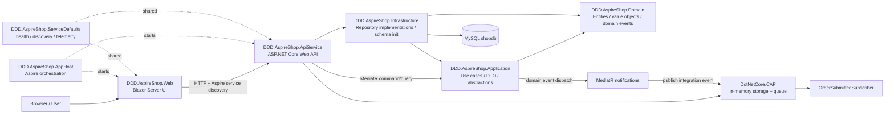
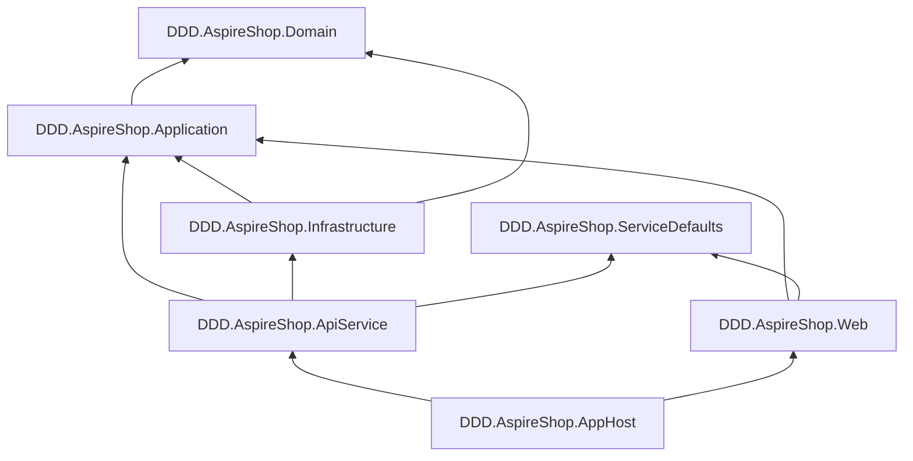
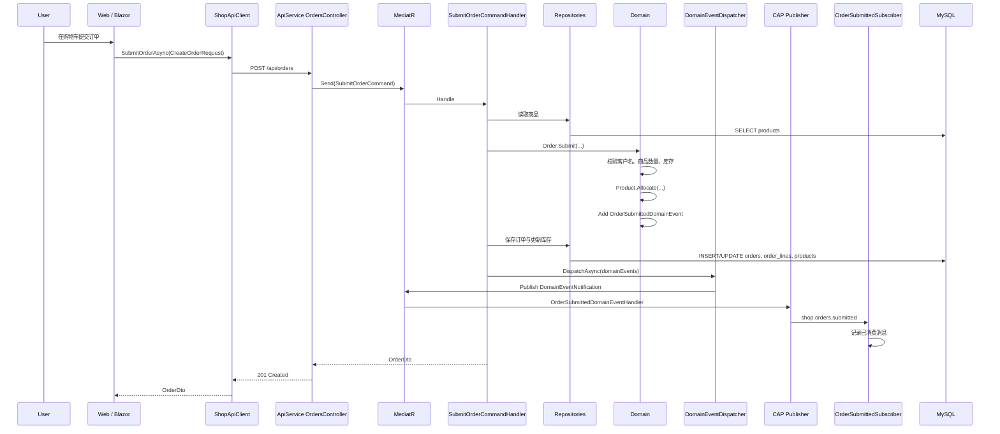
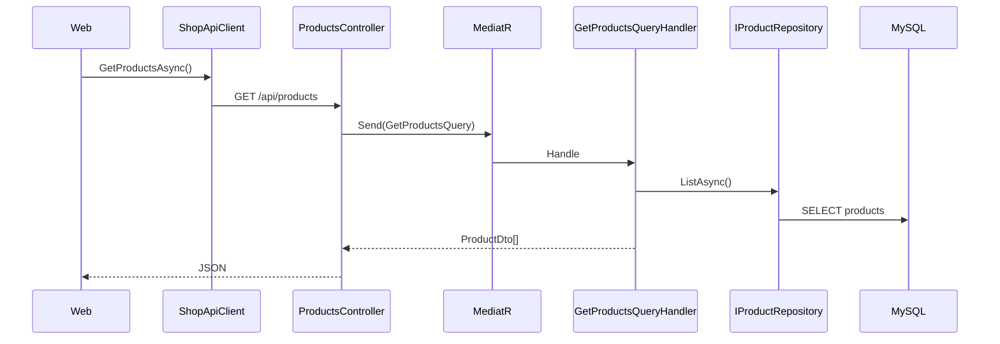
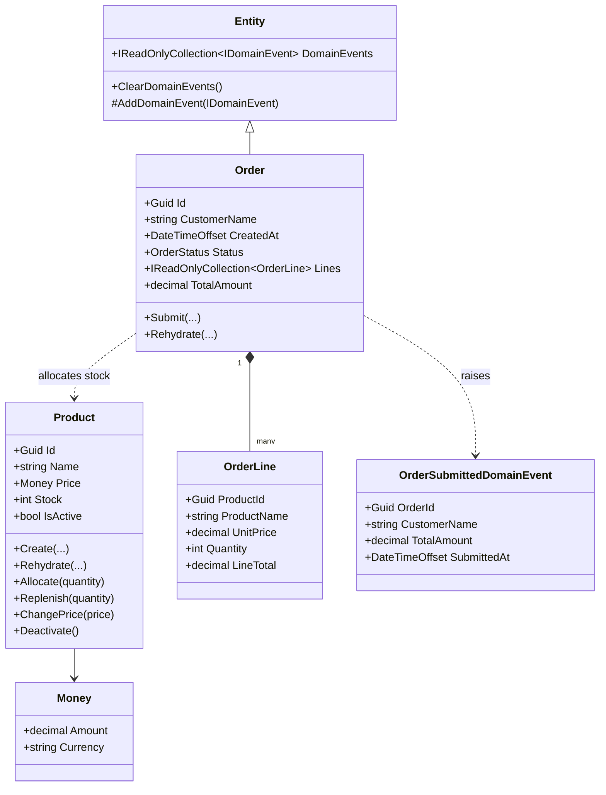

# DDD.AspireShop 项目结构图

本文档用于快速理解 `DDD.AspireShop` 的项目分层、依赖方向和核心业务链路。

## 1. 总体架构



## 2. 项目依赖图



依赖方向的重点：

- `Domain` 不依赖任何项目，是业务规则核心。
- `Application` 依赖 `Domain`，定义用例、DTO、仓储接口和事件发布抽象。
- `Infrastructure` 依赖 `Application` 与 `Domain`，实现仓储和数据库初始化。
- `ApiService` 组合应用层与基础设施层，对外暴露 HTTP API。
- `Web` 通过 HTTP 调用 `ApiService`，不直接访问数据库。
- `AppHost` 负责 Aspire 本地编排，启动 API 与 Web。

## 3. 目录结构

```text
DDD.AspireShop/
├── DDD.AspireShop.sln
├── aspire.config.json
├── DDD.AspireShop.AppHost/
│   └── AppHost.cs
├── DDD.AspireShop.ServiceDefaults/
│   └── Extensions.cs
├── DDD.AspireShop.Web/
│   ├── Program.cs
│   ├── ShopApiClient.cs
│   ├── ShoppingCartService.cs
│   ├── Components/
│   │   ├── Layout/
│   │   ├── Commerce/
│   │   └── Pages/
│   └── wwwroot/
├── DDD.AspireShop.ApiService/
│   ├── Program.cs
│   ├── Controllers/
│   │   ├── ProductsController.cs
│   │   ├── OrdersController.cs
│   │   └── FlashSalesController.cs
│   └── IntegrationEvents/
├── DDD.AspireShop.Application/
│   ├── Abstractions/
│   ├── Catalog/
│   ├── Orders/
│   ├── FlashSales/
│   └── DomainEvents/
├── DDD.AspireShop.Domain/
│   ├── Common/
│   ├── Products/
│   └── Orders/
├── DDD.AspireShop.Infrastructure/
│   ├── DependencyInjection.cs
│   ├── MySqlSchemaInitializer.cs
│   ├── MySqlProductRepository.cs
│   └── MySqlOrderRepository.cs
└── docs/
```

## 4. 分层职责

| 层 | 项目 | 主要职责 | 典型文件 |
| --- | --- | --- | --- |
| 编排层 | `AppHost` | Aspire 分布式应用编排，启动 Web 与 API | `AppHost.cs` |
| 共享基础配置 | `ServiceDefaults` | 健康检查、服务发现、OpenTelemetry、HTTP resilience | `Extensions.cs` |
| 表现层 | `Web` | Blazor Server 页面、购物车状态、API 客户端 | `Components/Pages/*`, `ShopApiClient.cs` |
| 接口层 | `ApiService` | REST API、MediatR 入口、CAP 订阅者注册 | `Controllers/*`, `Program.cs` |
| 应用层 | `Application` | 命令、查询、DTO、应用服务、仓储接口、事件抽象 | `SubmitOrderCommand.cs`, `GetProductsQuery.cs` |
| 领域层 | `Domain` | 实体、值对象、领域异常、领域事件、业务规则 | `Order.cs`, `Product.cs`, `Money.cs` |
| 基础设施层 | `Infrastructure` | MySQL 表初始化、种子数据、仓储实现 | `MySqlSchemaInitializer.cs`, `MySql*Repository.cs` |

## 5. 下单链路



## 6. 商品查询链路



## 7. 领域模型关系



## 8. API 一览

| Method | Path | 用途 | 入口 |
| --- | --- | --- | --- |
| `GET` | `/api/products` | 查询商品列表 | `ProductsController.GetAsync` |
| `GET` | `/api/orders` | 查询订单列表 | `OrdersController.GetAsync` |
| `POST` | `/api/orders` | 提交普通订单 | `OrdersController.SubmitAsync` |
| `GET` | `/api/orders/messages` | 查看已消费的订单集成事件 | `OrdersController.GetConsumedMessages` |
| `GET` | `/api/flash-sales` | 查询秒杀商品 | `FlashSalesController.GetAsync` |
| `POST` | `/api/flash-sales/orders` | 提交秒杀订单 | `FlashSalesController.SubmitAsync` |

## 9. 运行入口

推荐从 Aspire AppHost 启动：

```bash
cd DDD.AspireShop
dotnet run --project DDD.AspireShop.AppHost
```

`AppHost` 会启动：

- `apiservice`：后端 API，包含 OpenAPI、CAP Dashboard、健康检查。
- `webfrontend`：Blazor Server 前端，通过服务发现访问 `apiservice`。

